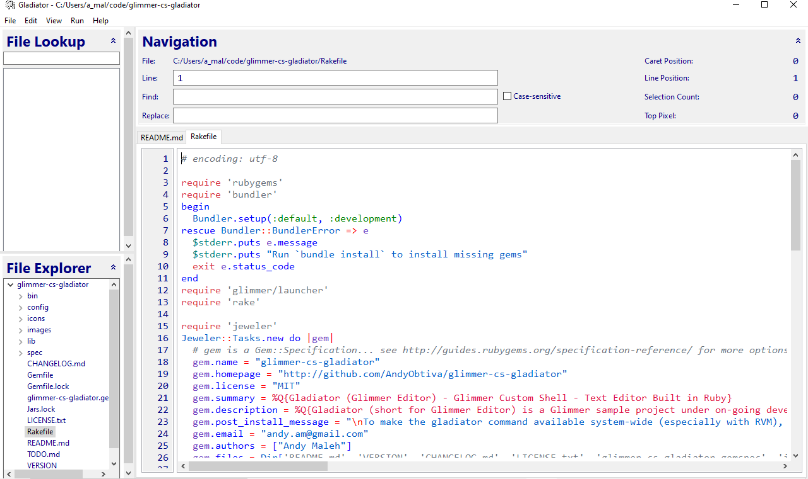

#  Gladiator 0.11.1 - [Ugliest Text Editor Ever!](https://www.reddit.com/r/ruby/comments/hgve8k/gladiator_glimmer_editor_ugliest_text_editor_ever/)
## [ Glimmer Custom Shell](https://github.com/AndyObtiva/glimmer-dsl-swt#custom-shell-gem)
[](http://badge.fury.io/rb/glimmer-cs-gladiator)

(**[***Montreal.rb Talk - How I Built My Code Editor in Ruby***](https://andymaleh.blogspot.com/2022/07/montrealrb-2022-07-07-talk-how-i-built.html)**)


Mac


Windows



[Gladiator](https://rubygems.org/gems/glimmer-cs-gladiator) (short for Glimmer Editor) is a [Glimmer DSL for SWT](https://github.com/AndyObtiva/glimmer-dsl-swt) beta project under on-going development that explores how to build a text editor in Ruby using [Glimmer DSL for SWT](https://github.com/AndyObtiva/glimmer-dsl-swt) (JRuby Desktop Development GUI Library).
It is not intended to be a full-fledged editor by any means, yet mostly a fun educational exercise in using [Glimmer](https://github.com/AndyObtiva/glimmer).
[Gladiator](https://rubygems.org/gems/glimmer-cs-gladiator) is also a personal tool for shaping an editor exactly the way I like, with all the keyboard shortcuts I prefer.
I leave building truly professional text editors to software tooling experts who would hopefully use [Glimmer](https://github.com/AndyObtiva/glimmer) one day. Otherwise, I have been happily using [Gladiator](https://rubygems.org/gems/glimmer-cs-gladiator) to develop all my [projects](https://github.com/AndyObtiva) since May of 2020.

[  You may now download a packaged version of Gladiator, including new support for Mac ARM64](#download)

## Features

[Gladiator](https://rubygems.org/gems/glimmer-cs-gladiator) currently supports the following text editing features (including keyboard shortcuts with Mac CMD=CTRL/CTRL=ALT on Windows/Linux)


### Text Editor

- Text Editor with Colored Syntax Highlighting for [Multiple Languages](#multiple-language-syntax-highlighting)
- Show Line Numbers
- Multi-tab support (CMD+SHIFT+[ & CMD+SHIFT+] for tab navigation. CMD+1-9 to jump to a specific tab)
- Drag and drop split pane (drag a file from File Tree or File Lookup List, and it splits the pane)
- Duplicate Line(s)/selection (CMD+D)
- Kill Line(s)/selection (CMD+K)
- Move line/selection up (CMD+UP)
- Move line/selection down (CMD+DOWN)
- Comment/Uncomment line/selection (CMD+/)
- Indent/Unindent line/selection (CMD+] & CMD+[)
- Insert/Prefix New Line (CMD+ENTER & CMD+SHIFT+ENTER)

### File Explorer Tree

- Collapsable file explorer tree listing files and directories for open project
- Context menu to open file, rename, delete, add new file, add new directory, and refresh tree
- Jump to open file in tree (CMD+T)

### File Lookup List Filter

- Collapsable file lookup list filter (CMD+R)
- Semi-fuzzy filtering by ignoring slashes, underscores, and dots to ease lookup

### Navigation Area

- Show current text editor file name
0- Show file navigation stats (Caret Position / Line Position / Selection Count / Top Pixel)
- Jump to Line (CMD+L)
- Find & Replace (CMD+F)

### Menus

- File Menu:
  - Open Scratchpad for running arbitrary Ruby/Glimmer code (saves a temporary file to `project_dir/.gladiator-scratchpad`) (CMD+SHIFT+S)
  - Open Project (CMD+O)
  - Quit Project (ALT+F4)
- View Menu
  - Split Pane
    - Orientation change to Horizontal/Vertical (CMD+SHIFT+O)
    - Maximize Pane: maximizes current pane in split pane to take entire area (CMD+SHIFT+M)
    - Reset Panes: resets pane sizes if split width/height was adjusted (CMD+SHIFT+P)
    - Unsplit: closes the second pane (CMD+SHIFT+U)
  - Maximize Editor: maximizes editor area to hide file lookup list and file explorer tree (CMD+CTRL+M)
  - Reset All: resizes sizes of all areas in the editor (CMD+CTRL+R)
- Run Menu to run Ruby code (CMD+SHIFT+R)

### Watch External Changes

- Watch open file for external changes to automatically refresh in editor
- Watch project subdirectories for changes to automatically refresh in file explorer/file lookup

### Automatic Data Management

- Autosave on focus out/quit/open new file
- Remember opened tabs, caret position, top pixel, window size, and window location
- [Default](#configuration) "ignore paths" to avoid bogging down editor with irrelevant directory files

### Multiple Language Syntax Highlighting

Here is an exhaustive list of all the file formats supported by [Gladiator](https://rubygems.org/gems/glimmer-cs-gladiator) (if you would like support for more file formats, feel free to suggest in a [GitHub Issue](https://github.com/AndyObtiva/glimmer-cs-gladiator/issues) or submit a [Pull Request](https://github.com/AndyObtiva/glimmer-cs-gladiator/pulls)):
1. C (`'c', 'h'`)
1. C++ (`'cpp', 'cc', 'C', 'cxx', 'c++', 'hpp', 'hh', 'H', 'hxx', 'h++'`)
1. C# (`'cs'`)
1. Crystal (`'cr'`)
1. CSS (`'css'`)
1. Conf (`'conf'`)
1. CoffeeScript (`'coffee'`)
1. Elixir (`'ex', 'exs'`)
1. Embedded Elixir (`'eex', 'leex', 'heex'`)
1. ERB (`'erb'`)
1. Gherkin Feature (`'feature'`)
1. Gradle (`'gradle'`)
1. Haml (`'haml'`)
1. HTML (`'html'`)
1. INI (`'ini'`)
1. Java (`'java'`)
1. JavaScript (`'js', 'cjs', 'mjs', 'es6', 'es'`)
1. JSON (`'json'`)
1. JSP (`'jsp'`)
1. JSX (`'jsx'`)
1. Kotlin (`'kt', 'ktm', 'kts'`)
1. Make (`'Makefile', 'makefile', 'GNUmakefile'`)
1. Markdown (`'md', 'markdown'`)
1. Diff Patch (`'patch'`)
1. Perl (`'pl'`)
1. Plist (`'plist'`)
1. Puppet (`'pp'`)
1. Properties (`'properties'`)
1. PostScript (`'ps'`)
1. PowerShell (`'ps1'`)
1. Python (`'py'`)
1. Ruby (`'rb'`, `'rbw'`, `'rake'`, `'gemspec'`)
1. Rust (`'rs'`)
1. SASS (`'sass'`)
1. Scheme (`'scm', 'sps', 'sls', 'sld'`)
1. SCSS (`'scss'`)
1. Shell (`'sh'`)
1. SQL (`'sql'`)
1. Tcl (`'tcl'`)
1. TypeScript (`'ts'`)
1. TSX (`'tsx'`)
1. Yaml (`'yaml', 'yml'`)
1. XML (`'xml'`)

## Platforms

- Mac: [Gladiator](https://rubygems.org/gems/glimmer-cs-gladiator) works best on the Mac. This is the platform it is most used on and receives the most maintenance for.
- Windows: [Gladiator](https://rubygems.org/gems/glimmer-cs-gladiator) works OK on Windows, but has a few annoying issues.
- Linux: [Gladiator](https://rubygems.org/gems/glimmer-cs-gladiator) works with handicaps on Linux (performing some text editing operations causes scroll jitter). Contributers could help fix.

## Pre-requisites

- [JDK](https://www.oracle.com/java/technologies/javase-downloads.html): Same version required by [Glimmer DSL for SWT](https://github.com/AndyObtiva/glimmer-dsl-swt)
- [JRuby](https://www.jruby.org/download): Same version required by [Glimmer DSL for SWT](https://github.com/AndyObtiva/glimmer-dsl-swt)
- [Glimmer DSL for SWT](https://github.com/AndyObtiva/glimmer-dsl-swt) (JRuby Desktop Development GUI Framework) (dependency included in Ruby gem).

## Download

[ Download Gladiator 0.11.1 Mac DMG Installer (ARM64 Ventura 13.4.1 & Older)](https://www.dropbox.com/scl/fi/iyyubcqekhtn4rv91feka/Gladiator-0.11.1-arm64-ventura-13.4.1.dmg?rlkey=ht2bt4jqf6bmgfjy0aurt2fem&dl=1) (this version starts in about 2.5 seconds)

[ Download Gladiator 0.11.1 Mac DMG Installer (x64 Ventura 13.4.1 & Older)](https://www.dropbox.com/scl/fi/04y1zkslld876cqv3mbls/Gladiator-0.11.1-x86_64-ventura-13.4.1.dmg?rlkey=0dhzhcejgx31w6iuj3qs2z7zs&dl=1)

[ Download Gladiator 0.10.0 Mac DMG Installer (x64 Catalina & Older)](https://www.dropbox.com/s/rxta4yio71mei8f/Gladiator-0.10.0.dmg?dl=1)

[ Download Gladiator 0.10.0 Windows MSI Installer (x64 Windows 10)](https://www.dropbox.com/s/3arjz0754j5nul2/Gladiator-0.10.0.msi?dl=1)

The packaged version starts with a dialog asking you what project to open. [Gladiator](https://rubygems.org/gems/glimmer-cs-gladiator) does not fully show up until you have selected a project directory.

Otherwise, if you prefer a command line version, then follow the Setup Instructions below.

## Setup Instructions

Note: if you encounter any issues, check if they are documented in [TODO.md](TODO.md), [issues](https://github.com/AndyObtiva/glimmer-cs-gladiator/issues), or [pull requests](https://github.com/AndyObtiva/glimmer-cs-gladiator/pulls) as they might be on my radar to fix. Otherwise, please report as an [issue](https://github.com/AndyObtiva/glimmer-cs-gladiator/issues) or better yet fix and submit a [pull request](https://github.com/AndyObtiva/glimmer-cs-gladiator/pulls). Also, try going back to a [previous version of the gem](https://rubygems.org/gems/glimmer-cs-gladiator/versions) until you find one that works. Keep in mind this is open-source software provided as is, so there are no guarantees of functionality. If you would like such guarantees, you are welcome to [hire me full-time](https://www.linkedin.com/in/andymaleh/).

Install [Gladiator](https://rubygems.org/gems/glimmer-cs-gladiator) gem by running (`jgem`, `jruby -S gem`, or `gem` directly if you have [RVM](https://rvm.io/)):

```
jgem install glimmer-cs-gladiator -v0.11.1
```

Or add to a JRuby project Bundler `Gemfile` under the `:developement` group:

```
group :development do
  gem 'glimmer-cs-gladiator', '> 0'
end
```

Run (`jruby -S bundle` or `bundle` directly if you have [RVM](https://rvm.io/)):

```
jruby -S bundle
```

Afterwards, if you are using [RVM](https://rvm.io/) and want to ensure system wide availablility of the `gladiator` command across Ruby versions, run this command in an environment that has JRuby (not needed without [RVM](https://rvm.io/)):

```
gladiator-setup
source ~/.gladiator_source
```

You should be able to run `gladiator` from anywhere now.

You can pass a project path as a first argument to open a particular project.

Alternatively, open in app mode (gives you a dialog to open any project) by passing `APP_MODE=true` argument/env-var.

## Usage

You may run the `gladiator` command to bring up the text editor in the project directory you would like to edit:

```
gladiator
```

On Linux, you may need to run with extra memory via this command instead:

```
gladiator -J-Xmx1200M
```

On Windows, you may need to run with extra memory via this command instead:

```
gladiator -J-Xmx3000M
```

If you are in a different directory from the project you would like to edit, then pass its path as an argument:

```
gladiator relative-or-absolute-path/to/project
```

Note: If you cloned this project and bundle installed, you may invoke via `bin/gladiator` instead.

### Glimmer Custom Shell Reuse

To reuse [Gladiator](https://rubygems.org/gems/glimmer-cs-gladiator) as a Glimmer Custom Shell inside another Glimmer application, add the
following to the application's `Gemfile`:

```
gem 'glimmer-cs-gladiator', '~> 0.11.1'
```

Run:

```
jruby -S bundle
```

And, then instantiate the [Gladiator](https://rubygems.org/gems/glimmer-cs-gladiator) [custom shell](https://github.com/AndyObtiva/glimmer-dsl-swt#custom-shells) in your [Glimmer DSL for SWT](https://github.com/AndyObtiva/glimmer-dsl-swt) application via the `gladiator` keyword assuming you already have `include Glimmer` in your class, module, or main object.

## Env Var Options

[Gladiator](https://rubygems.org/gems/glimmer-cs-gladiator) supports these environment variable options.

### LOCAL_DIR

(String / default: `'.'`)

[Gladiator](https://rubygems.org/gems/glimmer-cs-gladiator) opens with the current directory as the root by default.
If you would like to open another directory, set `LOCAL_DIR` environment variable.

Example:

```
LOCAL_DIR="/Users/User/code" gladiator
```

Opens [Gladiator](https://rubygems.org/gems/glimmer-cs-gladiator) with "/Users/User/code" as the root directory.

### APP_MODE

(`true` or `false` / default: `false` from terminal/command-line and `true` from [packaged Gladiator](#download))

Specifies whether to run in app mode, thus providing a dialog to open any project path instead of starting with a specific project from the get-go.

Example:

```
APP_MODE=true gladiator
```

## Configuration

[Gladiator](https://rubygems.org/gems/glimmer-cs-gladiator) automatically saves configuration data in a `.gladiator` file at the directory it is run from. It may be edited to add extra ignore paths.

It currently remembers:
- Last opened files (in both split panes if split)
- Window size and position
- Ignore Paths under `Glimmer::Gladiator::Dir::IGNORE_PATHS` (default: `['.gladiator', '.git', 'coverage', 'packages', 'node_modules', 'tmp', 'vendor', 'pkg', 'dist']`)

## Gotchas

### Signaling Error

[Gladiator](https://rubygems.org/gems/glimmer-cs-gladiator) repetitively displays a signaling error that is harmless in practice:
```
The signal HUP is in use by the JVM and will not work correctly on this platform
The signal INT is in use by the JVM and will not work correctly on this platform
The signal TERM is in use by the JVM and will not work correctly on this platform
```

### App Is Not Responding

If you run the `gladiator` command from the root directory or some parent directory to many projects, it assumes that is
the project directory and attempts to pre-load all files (just part of [Gladiator](https://rubygems.org/gems/glimmer-cs-gladiator)'s architectural design and assumptions for optimizing use per project), taking a very long time and not responding for quite a while.

To avoid this problem, always make sure you are running the `gladiator` command from a single project's directory.

Also, if you encounter this issue with projects that contain a lot of extra files that you do not need to edit, you
could later open the generated `.gladiator` file at the root of the project directory and add unnecessary subdirectories
to the `ignore_paths` array.

### Freezing in large projects

Gladiator right now assumes smaller projects with a few files only as it always opens all file contents in memory for better searching. So, when a file is updated externally (e.g. change git branch), it reloads its entire tree, including all the file contents too, which causes a temporary freeze. This may get fixed in the future, but it is not annoying enough in smaller projects to be fixed right away. The change might include diffing the tree to avoid refreshing file contents for unchanged files, and perhaps multi-threaded loading of file contents to avoid freezing the GUI.

## TODO

[TODO.md](TODO.md)

## Change Log

[CHANGELOG.md](CHANGELOG.md)

## Contributing to glimmer-cs-gladiator
 
- Check out the latest master to make sure the feature hasn't been implemented or the bug hasn't been fixed yet.
- Check out the issue tracker to make sure someone already hasn't requested it and/or contributed it.
- Fork the project.
- Start a feature/bugfix branch.
- Commit and push until you are happy with your contribution.
- Make sure to add tests for it. This is important so I don't break it in a future version unintentionally.
- Please try not to mess with the Rakefile, version, or history. If you want to have your own version, or is otherwise necessary, that is fine, but please isolate to its own commit so I can cherry-pick around it.
- On windows, add this Git config: `git config core.autocrlf input` (or globally if you're working on multiple Glimmer projects)

## Copyright

[MIT](https://opensource.org/licenses/MIT)

Copyright (c) 2020-2022 Andy Maleh. See [LICENSE.txt](LICENSE.txt) for further details.

--

[](https://github.com/AndyObtiva/glimmer) Built with [Glimmer DSL for SWT](https://github.com/AndyObtiva/glimmer-dsl-swt) (JRuby Desktop Development GUI Framework)

Gladiator icon made by <a href="https://www.flaticon.com/authors/freepik" title="Freepik">Freepik</a> from <a href="https://www.flaticon.com/" title="Flaticon">www.flaticon.com</a>
