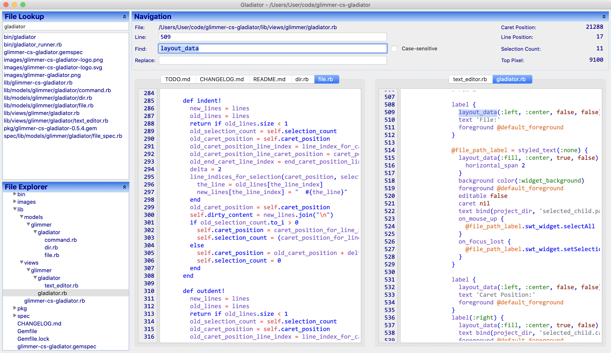

#  Gladiator 0.2.1 - [Ugliest Text Editor Ever](https://www.reddit.com/r/ruby/comments/hgve8k/gladiator_glimmer_editor_ugliest_text_editor_ever/)
## [Glimmer Custom Shell](https://github.com/AndyObtiva/glimmer#custom-shell-gem)
[](http://badge.fury.io/rb/glimmer-cs-gladiator)



Gladiator (short for Glimmer Editor) is a [Glimmer](https://github.com/AndyObtiva/glimmer) sample project under on-going development that demonstrates how to build a text editor in [Glimmer](https://github.com/AndyObtiva/glimmer) (Ruby Desktop Development GUI Library).
It is not intended to be a full-fledged editor by any means, yet mostly a fun educational exercise in using [Glimmer](https://github.com/AndyObtiva/glimmer).
Gladiator is also a personal tool for shaping an editor exactly the way I like, with all the keyboard shortcuts I prefer. 
I leave building truly professional text editors to software tooling experts who would hopefully use [Glimmer](https://github.com/AndyObtiva/glimmer) one day. Otherwise, I have been happily using Gladiator to develop all my [open-source projects](https://github.com/AndyObtiva) since May 2020.

## Features

Gladiator currently supports the following text editing features (including keyboard shortcuts with Mac CMD=CTRL on Windows/Linux):
- File explorer navigation with context menu to open file, rename, delete, add new file, add new directory, or refresh tree (CMD+T)
- File lookup by name ignoring slashes, underscores, and dots to ease lookup (CMD+R)
- Watch open file for external changes to automatically refresh in editor
- Watch project subdirectories for changes to automatically refresh in file explorer/file lookup
- Find & Replace (CMD+F)
- Show Line Numbers
- Jump to Line (CMD+L)
- Multiple tab support (CMD+SHIFT+[ & CMD+SHIFT+] for tab navigation. CMD+1-9 to jump to a specific tab)
- Remember opened tabs, caret position, top line, window size, and window location
- Autosave on focus out/quit/open new file 
- Duplicate Line(s)/selection (CMD+D)
- Kill Line(s)/selection (CMD+K)
- Move line/selection up (CMD+UP)
- Move line/selection down (CMD+DOWN)
- Comment/Uncomment line/selection (CMD+/)
- Indent/Unindent line/selection (CMD+] & CMD+[)
- Insert/Prefix New Line (CMD+ENTER & CMD+SHIFT+ENTER)
- Drag and Drop Text Editor Split Screen (drag a file from File Tree or File Lookup List, and it splits the screen)

## Platforms

- Mac: Gladiator works best on the Mac.
- Windows: Gladiator works well on Windows.
- Linux: Gladiator works with handicaps on Linux (performing text editing operations causes scroll jitter)

## Pre-requisites

- [Glimmer DSL for SWT](https://github.com/AndyObtiva/glimmer) (Ruby Desktop Development GUI Library): '>= 0.1.0', '< 2.0.0' (dependency included in Ruby gem).
- [JRuby](https://www.jruby.org/download): Same version required by [Glimmer](https://github.com/AndyObtiva/glimmer)
- [JDK](https://www.oracle.com/java/technologies/javase-downloads.html): Same version required by [Glimmer](https://github.com/AndyObtiva/glimmer)

## Setup Instructions

Install Gladiator gem by running (`jgem`, `jruby -S gem`, or `gem` directly if you have [RVM](https://rvm.io/)):

```
jgem install glimmer-cs-gladiator
```

Or add to a JRuby project Bundler `Gemfile` under the `:developement` group:

```
group :development do
  gem 'glimmer-cs-gladiator'
end
```

Run (`jruby -S bundle` or `bundle` directly if you have [RVM](https://rvm.io/)):

```
jruby -S bundle
```

## Usage

You may run the `gladiator` command to bring up the text editor in the project directory you would like to edit:

```
gladiator
```

If you are in a different directory from the project you would like to edit, then pass its path as an argument:

```
gladiator relative-or-absolute-path/to/project
```

Note: If you cloned this project and bundle installed, you may invoke via `bin/gladiator` instead.

If your project is not a JRuby project, then you cannot install [glimmer-cs-gladiator](https://rubygems.org/gems/glimmer-cs-gladiator), so you must install in a separate JRuby environment and invoke by passing the project path as per command above. Alternatively, you may clone this project, and invoke gladiator via `bin/gladiator` (that's how I use Gladiator for most of my projects):

```
bin/gladiator relative-or-absolute-path/to/project
```

### Glimmer Custom Shell Reuse

To reuse Gladiator as a Glimmer Custom Shell inside another Glimmer application, add the 
following to the application's `Gemfile`:

```
gem 'glimmer-cs-gladiator', '~> 0.2.1'
```

Run:

```
jruby -S bundle
```

And, then instantiate the Gladiator [custom shell](https://github.com/AndyObtiva/glimmer#custom-shells) in your [Glimmer](https://github.com/AndyObtiva/glimmer) application via the `gladiator` keyword assuming you already have `include Glimmer` in your class, module, or main object.

## Env Var Options

Gladiator opens with the current directory as the root by default. 
If you would like to open another directory, set `LOCAL_DIR` environment variable.

Example:

```
LOCAL_DIR="/Users/User/code" gladiator
```

Opens Gladiator with "/Users/User/code" as the root directory.

## Configuration

Gladiator automatically saves configuration data in a `.gladiator` file at the directory it is run from.

It currently remembers:
- Last opened file
- Caret position
- Top line position
- Opened tabs

## Gotcha

Gladiator repetitively displays a signaling error that is harmless in practice:
```
The signal HUP is in use by the JVM and will not work correctly on this platform
The signal INT is in use by the JVM and will not work correctly on this platform
The signal TERM is in use by the JVM and will not work correctly on this platform
```

## TODO

[TODO.md](TODO.md)

## Contributing to glimmer-cs-gladiator
 
- Check out the latest master to make sure the feature hasn't been implemented or the bug hasn't been fixed yet.
- Check out the issue tracker to make sure someone already hasn't requested it and/or contributed it.
- Fork the project.
- Start a feature/bugfix branch.
- Commit and push until you are happy with your contribution.
- Make sure to add tests for it. This is important so I don't break it in a future version unintentionally.
- Please try not to mess with the Rakefile, version, or history. If you want to have your own version, or is otherwise necessary, that is fine, but please isolate to its own commit so I can cherry-pick around it.

## Copyright

Copyright (c) 2020 Andy Maleh. See LICENSE.txt for
further details.

Gladiator icon made by <a href="https://www.flaticon.com/authors/freepik" title="Freepik">Freepik</a> from <a href="https://www.flaticon.com/" title="Flaticon">www.flaticon.com</a>
